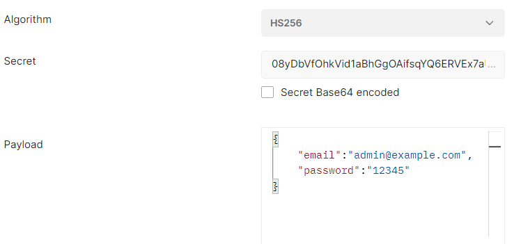
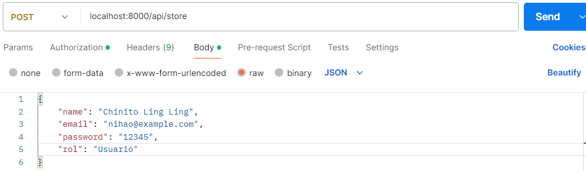

# Prueba Back-End Laravel
 
### Realizó :  Fidel Zarco 

## Instrucciones para desplegar

### Composer
 - Ejecutar ```composer install ```

### Base de datos y .env
 - Crear el schema en MYSQL
 - Copiar y pegar el archivo .env.example y renombrarlo a ```.env ```
 - Dentro del archivo ```.env ``` modificar el campo ```DB_DATABASE ``` con el nombre del schema que se creo, modificar el campo ```DB_USERNAME ``` con el nombre del superusuario de la base de datos, modificar el campo ```DB_PASSWORD ``` con la contraseña del superusuario de la base de datos
  - Ejecutar ```php artisan migrate```
  - Ejecutar ```php artisan db:seed```

### JWT 
- Ejecutar ```php artisan jwt:secret```
- Nota: Guardar la clave que genere para ingresarlo en POSTMAN 

### Ejecutar endpoints
   - Ejecutar ```php artisan serve```

### Recomendaciones Y Notas Finales
 
 - Debe agregar sus credenciales en el token a enviar: 
 
 Donde Secret es su token generado previamente, Payload son sus credenciales que por defecto hay dos usuarios creados por el seeder ```email: admin@example.com, password: 12345 ``` (Administrador)
 ```email: user@example.com, password: 12345 ``` (Usuario).

 - Puede consultar las diferentes rutas a las cuales hacer solicitudes en ```routes/api.php ``` 
 - Para las rutas donde se le pide un identificador como en: show, update y destroy. Deberá ingresar el ```email``` del usuario. Ejemplo para solicitar informacion de un usuario, la ruta sería la siguiente: ```localhost:8000/api/show/admin@example.com```  donde ```admin@example.com``` se toma como identificador del usuario ya que esto se especificó en el diagrama relacional de las tablas.
 - Para las solicitudes donde se requiere enviar datos al endpoint como son: store y update, deberá añadir los datos en formato JSON dentro del body de la solicitud. 
 Ejemplo guardar un nuevo usuario:
 

 Ejemplo editar un usario ya existente: 
 
